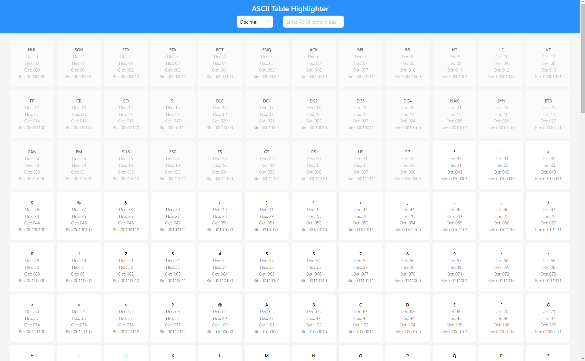

# ASCII Table App

An interactive ASCII table built with React and TypeScript, providing a comprehensive view of all ASCII characters and their corresponding codes in various number systems.



### Table of Contents

- [Demo](#demo)
- [Features](#features)
- [Installation](#installation)
- [Usage](#usage)
- [Deployment](#deployment)
- [Technologies Used](#technologies-used)
- [Contributing](#contributing)
- [License](#license)
- [Contact](#contact)

## Demo

Check out the live application here:

[**Live Demo**](https://ascii-highlighted.netlify.app/)

## Features

- **Full ASCII Character Set**: Explore all 256 ASCII characters.
- **Detailed Codes**: View decimal, hexadecimal, octal, and binary codes.
- **Copy Functionality**: Easily copy any printable character to the clipboard.
- **Highlighting**: Selected characters are highlighted for better visibility.
- **Smooth Scrolling**: Automatically scrolls to highlighted characters.
- **Responsive Layout**: Adapts to various screen sizes for optimal user experience.

## Installation

Follow these steps to set up the project locally:

1. **Clone the repository:**

 ```bash
 git clone https://github.com/YannickBaudrazascii-highlighted.git
 cd ascii-highlighted
 ```

2. **Install the dependencies:**

```bash
yarn install
```

## Usage

### Running the App Locally

Start the development server:

```bash
yarn start
```

Open [http://localhost:5173](http://localhost:5173) to view it in the browser.

### Building for Production

Create an optimized production build:

```bash
yarn build
```

## Technologies Used

- **React**: A JavaScript library for building user interfaces.
- **TypeScript**: A typed superset of JavaScript that compiles to plain JavaScript.
- **Ant Design**: A UI library for React for designing user interfaces.
